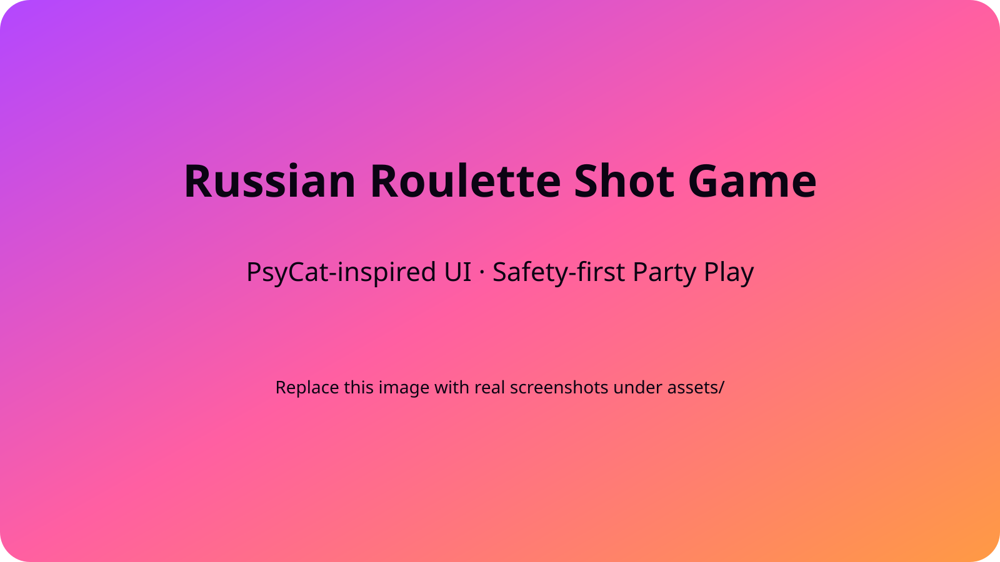

# Russian Roulette Shot Game

A vibrant, PsyCat-inspired party game web experience. Hosts can spin up quick rooms, invite friends via link/QR, play multi-round Russian roulette shot sessions, share results, and toggle safety-first features like non-alcohol mode.

 <!-- Replace with real capture under assets/ when available -->

## ✨ Features

- **Quick Game + Events**: Create instant rooms or boot from preset drinking events.
- **Lobby Management**: Readiness states, invite QR, host controls.
- **Gameplay Simulation**: Round-by-round trigger pulls, auto logs, probability-based hits.
- **Safety Layer**: Overdrinking alerts, one-tap non-alcohol mode, safety guide modal.
- **Results & History**: Shareable ranking cards, rematch workflow, persistent history timeline.

## 🧱 Tech Stack

- Plain HTML/CSS/JavaScript for the prototype UI.
- [Vite](https://vitejs.dev/) for local dev server & build output.
- GitHub Actions workflow to ensure builds stay green.

## 🚀 Getting Started

```bash
# install deps
npm install

# start local dev server (http://localhost:5173)
npm run dev

# generate static build into dist/
npm run build

# preview production bundle
npm run preview

# lint, format, and test
npm run lint
npm run test
npm run format
npm run test:e2e   # placeholder Playwright hook (set RUN_PLAYWRIGHT=true to run for real)
```

### Static Hosting

- The generated `dist/` folder can be deployed to GitHub Pages, Netlify, Vercel, or any static host.
- Update `vite.config.js` with a `base` value if the site lives under a subpath (e.g., `/idea-2-russian-rulette/`).

## 📂 Repository Structure

```
.
├── index.html              # Root document consumed by Vite
├── styles.css              # PsyCat-style theme
├── app.js                  # UI interactions, state handling
├── docs/                   # Research artifacts & reference material
│   ├── README.md
│   ├── psycatgames_uiux_analysis.md
│   └── russian_roulette_game_slides.md
├── CHANGELOG.md
├── package.json
├── vite.config.js
├── .github/workflows/ci.yml
└── ...
```

## 📝 Documentation

- Detailed UI/UX study: `docs/psycatgames_uiux_analysis.md`
- Full experience slides: `docs/russian_roulette_game_slides.md`
- Documentation index & usage rules: `docs/README.md`
- Deployment workflow checklists: `docs/DEPLOYMENT.md`

## 🌐 Localization

- All UI/UX copy lives in `locales/{lang}.json`. Each entry maps to a `data-i18n` attribute in the markup or toasts in `app.js`.
- Switch languages from the header dropdown (JP/EN included). The selection persists via `localStorage`.
- Add a new language by duplicating a JSON file, translating the values, and adding the locale code to the dropdown + `loadLocale` call.

## 📸 Assets

- Capture updated screenshots/gifs into `assets/` and reference them inside this README.
- Use 1600×900 PNG for hero, 800×600 PNGs for flows, and optional MP4/GIF for gameplay.

## 🤝 Contributing

1. Fork the repo & create a feature branch: `git checkout -b feature/amazing`.
2. Run `npm run build` before pushing to ensure CI passes.
3. Submit a PR referencing the relevant research docs/issue IDs.

See [`CONTRIBUTING.md`](CONTRIBUTING.md) for style guides, commit conventions, and PR checklist.

## 🔐 License

Distributed under the MIT License. See [`LICENSE`](LICENSE) for details.

## 📅 Roadmap

- ✅ Prototype screens + logic
- ☐ Real backend + live multiplayer
- ☐ Share image generator
- ☐ Expanded safety analytics dashboard

## 🧪 Quality Gates

- GitHub Actions workflow (`.github/workflows/ci.yml`) runs `npm run build` on every push/PR.
- Extend with linting or visual regression checks as the project matures.

## 📣 Support / Questions

Open an issue or ping `@naokiwork` on GitHub. Include screenshots and reproduction steps when reporting bugs.
